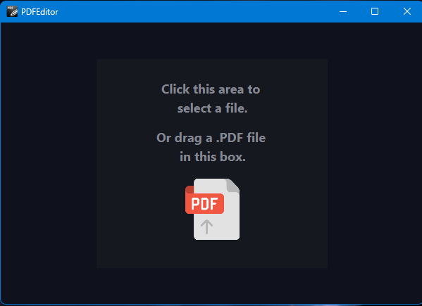
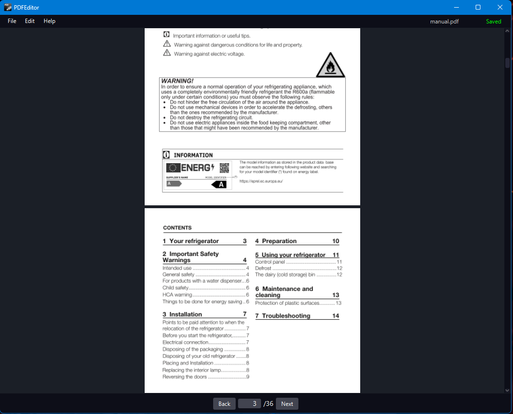

#  PDF Tool

The purpose of this project is to create a tool for manipulating PDF files. The tool allows the user to insert and/or remove pages from a uaser-chosen PDF document.
This project was born for a simple programming exercise with JavaFX GUI, it was also born for a exigency to take notes in university.
Please note: This program is not intended to be a PDF editor but a simple page manipulator.

## Table of Contents
- [UI](#ui)
- [Installation](#installation)
- [Installation Troubleshooting](#installation-troubleshooting)

## UI 
<p align="center">
  
</p>

<p align="center">
  
</p>

## Installation
You must have Java SE Dev Kit 21 or higher installed to use the program. [Download Java](https://www.oracle.com/it/java/technologies/downloads/#jdk22-windows)

To install it go to the Release section of GitHub and download the .jar file.
If Java is configured correctly you will be able to open the program in 2 ways:
1) Double click on PDFTool.jar
2) From command line, with the following commands
```
cd {Absolute path to the folder where you put you .jar}
java -jar PDFTool.jar
```

## Installation Troubleshooting
### Java Exception has occurred
On Windows, right click on the .jar file,<br>
Open with -> Choose another app -> More apps -> Look for another app on this PC -> Select javaw.exe in the bin folder of your JDK installation directory.

